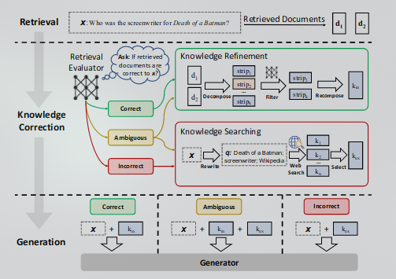

<h2 align="center">CRAG-langchain</h2>

langchain implementation of Shi-Qi Yan et., al (2024)

  

### Overview

In the proposed RAG[^3] pipeline, an evaluator is used to estimate the relevance score of retrieved documents to the input query. This score can be categorized into three confidence levels, each confidence level will trigger  subsequent actions. $(\text{Correct,Incorrect, Ambigious})$ 

If the action $\text{Correct}$ is triggered, the retrieved documents will be further refined into precise information. If the action $\text{Incorrect}$ is triggered, the retrieved documents will be discarded and relevant information will be retrieved through web searches. When the evaluator can not confidently make a strong judgement, $\text{Ambigious}$ is triggered, in which both retrieved documents and documents retrieved from web are used. These evaluated documents are then used by a generative model to generate the output.

### Retrieval Evaluator

According to the paper, A fine-tuned T5-large model is used to evaluate the documents. Their experiment with ChatGPT as an alternate evaluator showed that it performed comparably low to the fine-tuned model.  In this specific scenario we decided to use Gemini-Pro as a evaluator.

### Action Trigger

Based on the confidence level obtained from the evaluator, three types of actions are triggered. If the confidence score is higher than the upper threshold, the retrieved document is identified as $\text{Correct}$. $\text{Incorrect}$ if it is below the lower threshold. Otherwise, $\text{Ambigious}$. This process is conducted for each retrieved document individually.

#### Correct

It is considered that the documents retrieved from the vector database are relevant when the confidence score of _at least one retrieved document_ is higher than the upper threshold.

#### Incorrect

We consider the retrieved documents to be irrelevant (a.k.a $\text{Incorrect}$) when the confidence score of _all documents_ are below the lower threshold.

#### Ambiguous

In the event of having a scenario where the evaluator can not fit it's result into the aforementioned criteria, it will trigger an intermediate action called $\text{Ambigious}$. Since retriever evaluator is not confident in it's judgement, both types of processed knowledge are combined to complement each other.

### Knowledge Refinement

For each retrieved document, a decompose-then-recompose knowledge refinement method is designed to extract the most critical knowledge strips in it.

### Web Search

If all retrieved results are irrelevant, the subsequent actions invlove web search for relevant documents. In the paper Google seach API[^1] is used for retrieval but in this specific scenario we decided to use $\text{Tavily}$[^2].

[^1]: N. Vikramaditya, “googlesearch-python: A Python library for scraping the Google search engine.” Available: [https://github.com/Nv7-GitHub/googlesearch](https://github.com/Nv7-GitHub/googlesearch). [Accessed: Mar. 24, 2024]
[^2]: A. Elovic, “tavily-python: Python wrapper for the Tavily API.” Available: [https://github.com/assafelovic/tavily-python](https://github.com/assafelovic/tavily-python). [Accessed: Mar. 24, 2024]
[^3]: S.-Q. Yan, J.-C. Gu, Y. Zhu, and Z.-H. Ling, “Corrective Retrieval Augmented Generation.” arXiv, Jan. 28, 2024. doi: [10.48550/arXiv.2401.15884](https://doi.org/10.48550/arXiv.2401.15884). Available: [http://arxiv.org/abs/2401.15884](http://arxiv.org/abs/2401.15884). [Accessed: Feb. 07, 2024]